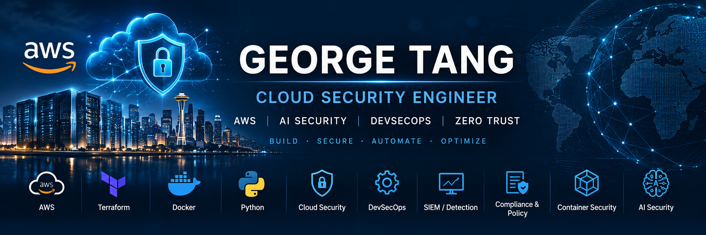

  

  

<h1 align="center">GEORGE TANG</h1>

<h3 align="center">Cloud Security Engineer</h3>

  AWS • Terraform • SIEM • Zero Trust • DevSecOps • AI Security • AI-Assisted Security Operations

## About Me

Cloud Security Engineer focused on designing, securing, monitoring, and automating enterprise cloud environments.

My hands-on work includes AWS multi-account security architecture, IAM and SSO, infrastructure as code, centralized logging, threat detection, vulnerability management, incident response, DevSecOps, container security, AI security, and AI-assisted security operations.

I use this GitHub portfolio to document real hands-on projects, architecture diagrams, Terraform code, security controls, testing evidence, screenshots, and lessons learned.
### Core Skills

- AWS Cloud Security
- AWS Organizations & Multi-Account Architecture
- IAM, SSO & Zero Trust
- Terraform & Infrastructure as Code
- SIEM & Security Monitoring
- Threat Detection & Incident Response
- Vulnerability Management
- DevSecOps
- Docker & Kubernetes Security
- Linux & Bash
- Python Security Automation
- AI Security
- AI-Assisted Security Operations
- NIST, SOC 2, HIPAA, ISO 27001, PCI DSS
### Featured Projects

#### FortressCloud — Enterprise AWS Security Foundation
Enterprise-scale AWS multi-account security environment built around AWS Organizations, 7 Organizational Units, 16 AWS accounts, centralized logging, IAM and SSO, Service Control Policy governance, Terraform, and organization-wide security controls.

#### SentinelAI — AI-Assisted Threat Detection & Incident Response
AI-assisted cloud security operations project focused on centralized security monitoring, SIEM workflows, threat detection, investigation, incident response automation, log analysis, and controlled remediation across the AWS environment.

#### CloudRiskAI — Vulnerability & Exposure Management
Cloud vulnerability, exposure, and attack-path risk management project combining AWS security findings, asset criticality, exploitability, identity risk, network exposure, risk-based prioritization, and AI-assisted remediation guidance.

#### SecureSphere — AWS Container Security & DevSecOps
Enterprise container security and DevSecOps project covering Docker, Amazon ECS, Amazon EKS, Kubernetes, CI/CD security, image scanning, secrets management, workload identity, runtime monitoring, network security, and software supply-chain protection.
### Currently Building

#### FortressCloud — Enterprise AWS Multi-Account Security Platform

Currently designing and implementing an enterprise-style AWS cloud security environment with:

- 7 Organizational Units (OUs)
- 16 AWS Accounts
- AWS Organizations
- IAM Identity Center / SSO
- Multi-Factor Authentication (MFA)
- Service Control Policies (SCPs)
- Centralized CloudTrail Logging
- AWS Security Hub
- Amazon GuardDuty
- AWS Config
- IAM Access Analyzer
- Amazon Inspector
- Centralized Networking
- Terraform Infrastructure as Code
- GitHub-based version control
- Security architecture diagrams
- Deployment screenshots and validation evidence

The environment will serve as the foundation for organization-wide threat detection, vulnerability management, AI-assisted security operations, and container security projects.
### Certifications & Continuous Learning

- CompTIA Security+ — In Progress
- AWS Security — Advanced Learning Path
- AWS Cloud Security Architecture
- Terraform & Infrastructure as Code
- Linux Administration for Cloud Security
- Docker, ECS, EKS & Kubernetes Security
- SIEM, Threat Detection & Incident Response
- Vulnerability Management
- AI Security & AI-Assisted Security Operations
- NIST Cybersecurity Framework
- SOC 2, HIPAA, ISO 27001 & PCI DSS
### Tools & Technologies

### Portfolio & Professional Links

- 🔐 [Cloud Security Engineering Lab](https://github.com/GeorgeTangSec/cloud-security-lab)
- 💼 [LinkedIn](https://www.linkedin.com/in/georgetang46/)
- 🧑‍💻 [GitHub](https://github.com/GeorgeTangSec)

### Professional Focus

Building hands-on expertise in:

- Enterprise AWS Cloud Security
- Multi-Account Security Architecture
- Identity, SSO & Zero Trust
- Detection Engineering & SIEM
- Incident Response Automation
- Vulnerability & Exposure Management
- DevSecOps & Container Security
- AI Security
- AI-Assisted Security Operations
### GitHub Activity

---

### Let's Connect

I'm focused on growing as a Cloud Security Engineer through hands-on enterprise projects in AWS security, DevSecOps, detection engineering, vulnerability management, container security, and AI Security.

I'm interested in connecting with cloud security professionals, security engineers, recruiters, and organizations working on modern cloud-security challenges.

[LinkedIn](https://www.linkedin.com/in/georgetang46/) • [Cloud Security Portfolio](https://github.com/GeorgeTangSec/cloud-security-lab)

---

**Building. Securing. Automating. Documenting.**
